## Integrals

::: fragment
An integral is a function or value that describes:
:::

-   The inverse of the derivative
-   The area under a curve
-   The accumulation of change
-   It can be
    -   *indefinite*: $\displaystyle \int f(x) \,dx = F(x)$
    -   *definite*: $\displaystyle \int_{a}^{b} f(x) \,dx  = F(b)-F(a)$

## Integrals

::: r-stack
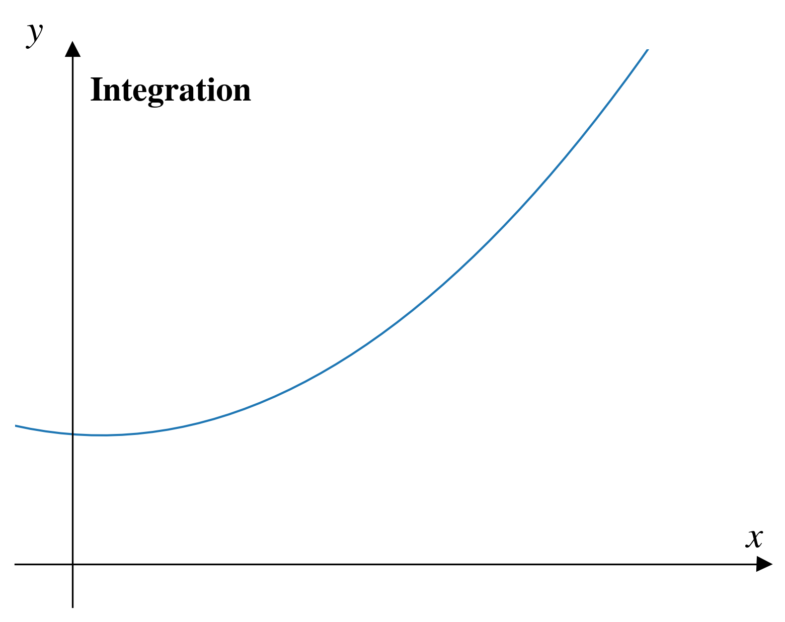{.absolute top="60" left="100" height="690"}

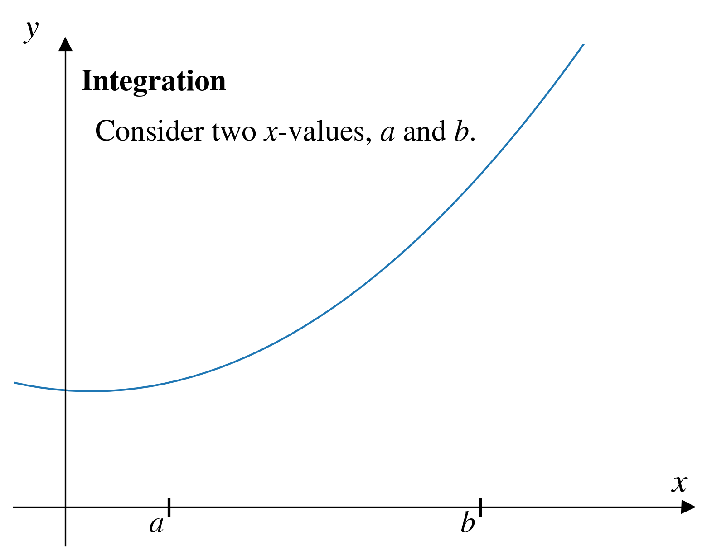{.fragment .absolute top="60" left="100" height="690"}

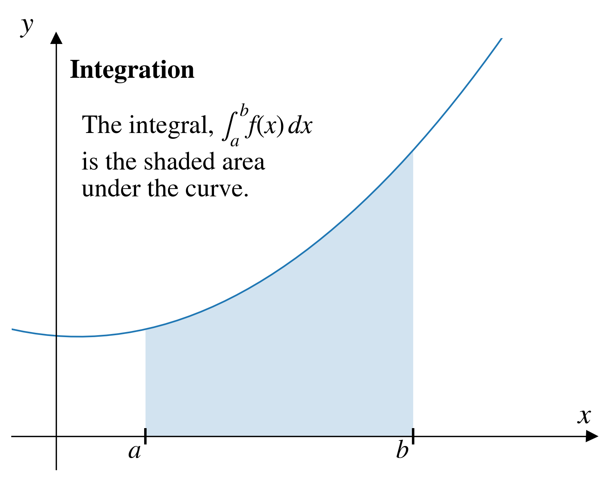{.fragment .absolute top="60" left="100" height="690"}
:::

## Approximating integrals

In numerical integration approximate the integral of a function, $f(x)$ by finding the integral of a simpler function $f_n(x)$.

::: fragment
If we assume that the simpler function is a **straight line** (which we'll call $f_1(x)$), we can approximate the integral using the **trapezoid rule**.
:::

## Trapezoid rule (part 1)

$$\int_{a}^{b} f(x)\,dx \approx \int_{a}^{b} f_1(x)\,dx$$

::: fragment
where

$$f_1(x) = \frac{f(b) - f(a)}{b-a}(x-a)+f(a)$$
:::

::: fragment
$f_1(x)$ is just the equation of a straight line that intersects $f(x)$ at the points $a$ and $b$.
:::

## Trapezoid rule (part 2)

The integral of $f_1(x)$ is simple to calculate:

$$\int_{a}^{b} f_1(x)\,dx = (b-a)\frac{f(a) + f(b)}{2}$$

:::{.fragment}
It's composed of two parts:

* the width: $(b-a)$
* the effective height: $\displaystyle \frac{f(a) + f(b)}{2}$
:::

## Trapezoid rule
::: r-stack
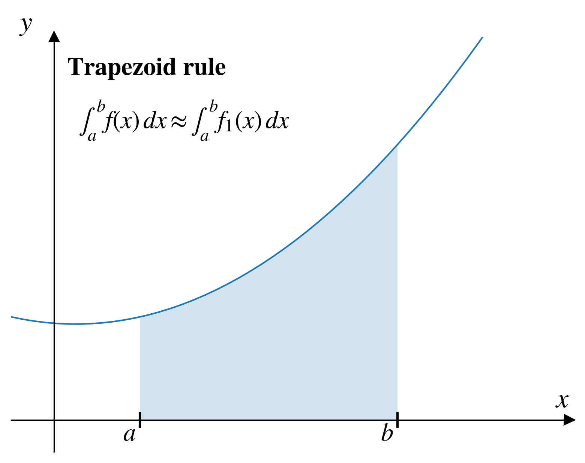{.absolute top="60" left="100" height="690"}

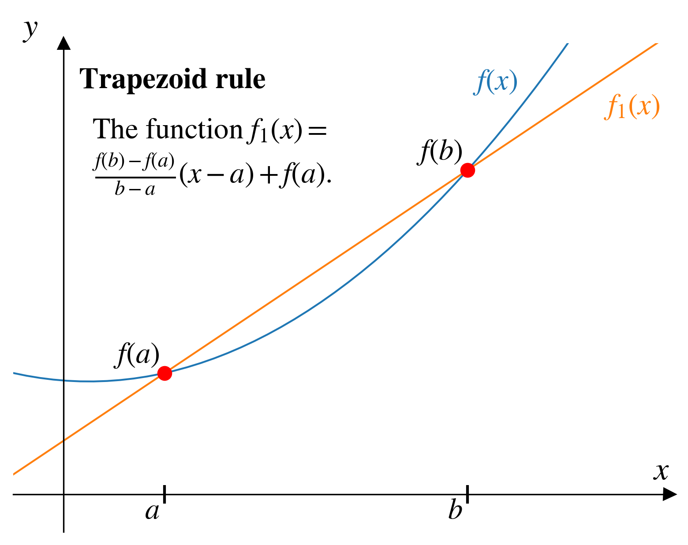{.fragment .absolute top="60" left="100" height="690"}

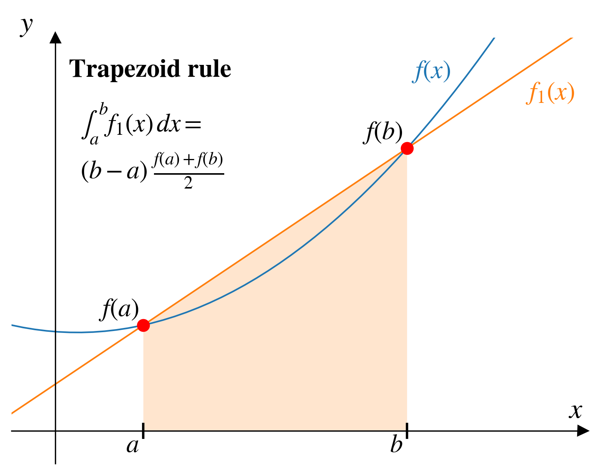{.fragment .absolute top="60" left="100" height="690"}

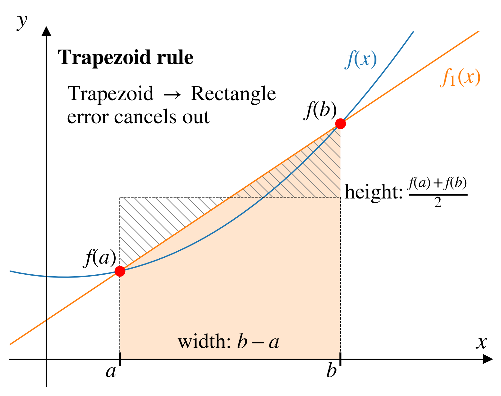{.fragment .absolute top="60" left="100" height="690"}
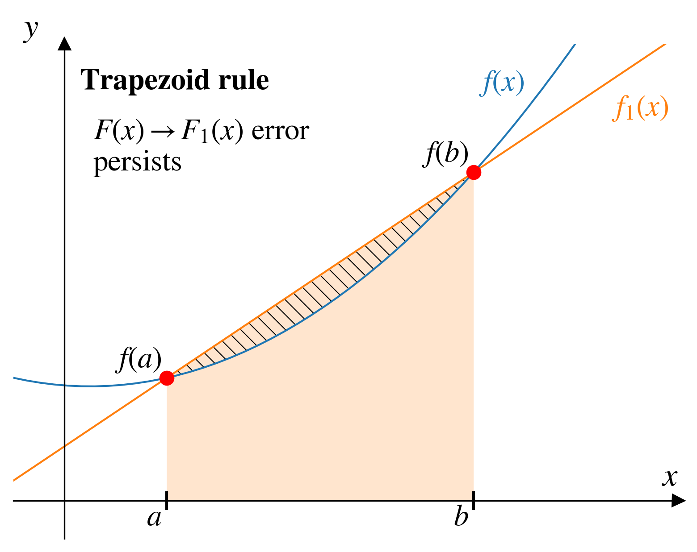{.fragment .absolute top="60" left="100" height="690"}
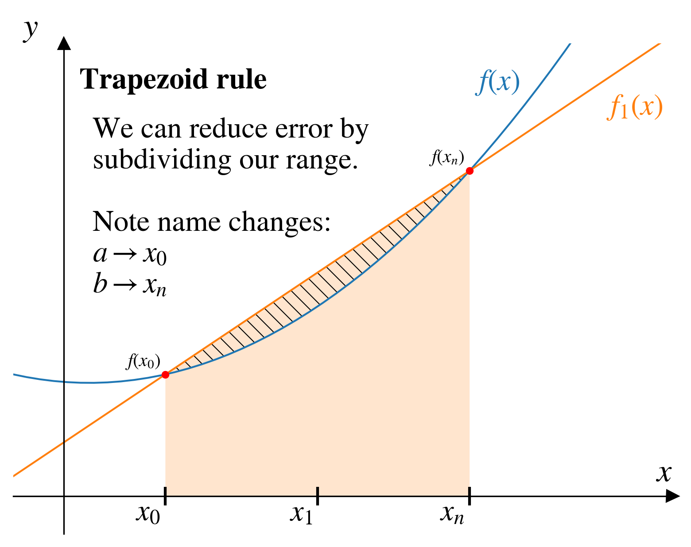{.fragment .absolute top="60" left="100" height="690"}

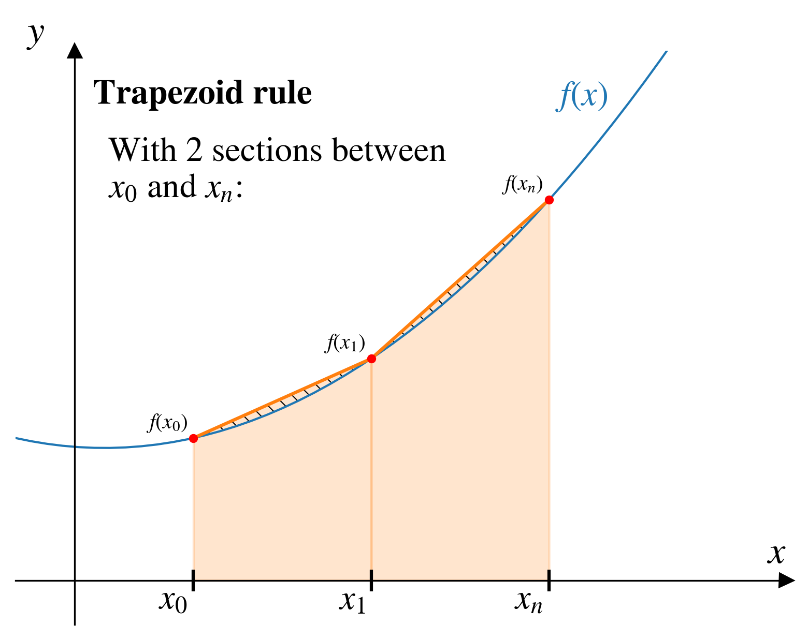{.fragment .absolute top="60" left="100" height="690"}

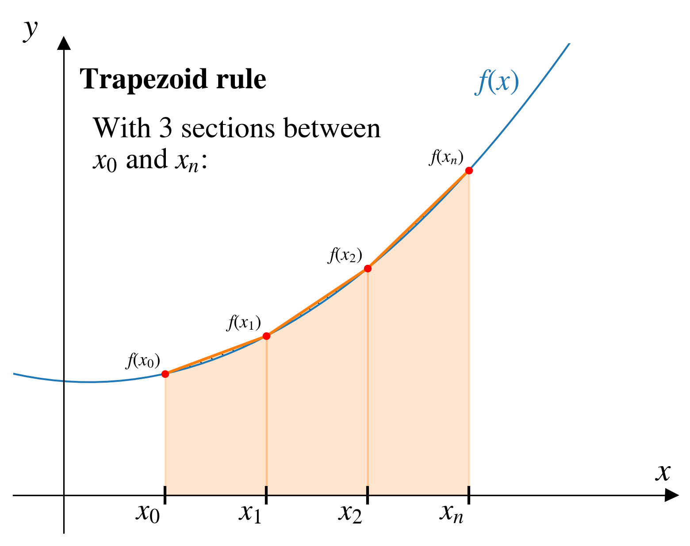{.fragment .absolute top="60" left="100" height="690"}

{.fragment .absolute top="60" left="100" height="690"}
:::

## $n-1$ again?

With $n$ points, our approximate integral gives us $n-1$ trapezoids...

:::{.fragment}
Think of each trapezoid as areas corresponding to $x_1$ through $x_n$.
:::

:::{.fragment}
If we want $n$ points for our integral, assign $x_0 = 0$ and then add the integration constant, $C$ to the entire integral array
:::


## Numerical integration in Scipy{.smaller}

Scipy has a function for discrete integration: `scipy.integrate.cumulative_trapezoid`

```{python}
#| echo: false
#| error: true
import numpy as np
import matplotlib.pyplot as plt
```


```{python}
#| code-line-numbers: ","
#| echo: true
#| output-location: fragment
#| error: true
from scipy.integrate import cumulative_trapezoid as trapz
dx = 0.05
x = np.arange(0,2*np.pi,dx)
y = np.sin(x)
I = trapz(y,x)
print(f"Length of x: {len(x)}")
print(f"Length of y: {len(y)}")
print(f"Length of I: {len(I)}")
```


## Numerical integration in Scipy{.smaller}

Scipy has a function for discrete integration: `scipy.integrate.cumulative_trapezoid`

```{python}
#| echo: false
#| error: true
import numpy as np
import matplotlib.pyplot as plt
```


```{python}
#| code-line-numbers: ","
#| echo: true
#| output-location: fragment
#| error: true
from scipy.integrate import cumulative_trapezoid as trapz
dx = 0.05
x = np.arange(0,2*np.pi,dx)
y = np.sin(x)
I = trapz(y,x,initial=0)
print("The length of x, y, and I:")
print(f"Length of x: {len(x)}")
print(f"Length of y: {len(y)}")
print(f"Length of I: {len(I)}")
```

## Numerical integration in Scipy{.smaller}

Scipy has a function for discrete integration: `scipy.integrate.cumulative_trapezoid`

```{python}
#| code-line-numbers: ","
#| echo: true
#| output-location: fragment
#| error: true
from scipy.integrate import cumulative_trapezoid as trapz
dx = 0.05
x = np.arange(0,2*np.pi,dx)
y = np.sin(x)
I = trapz(y,x,initial=0)
```

:::{.fragment}
```{python}
#| echo: false
#| error: true
fig, ax = plt.subplots()
ax.plot(x,y, label="sin(x)")
ax.plot(x, I, label="integral of sin(x)")
ax.legend()
ax.set_xlabel("x")
ax.set_ylabel("y")
plt.show()
```
:::

## Numerical integration in Scipy{.smaller}

Scipy has a function for discrete integration: `scipy.integrate.cumulative_trapezoid`

```{python}
#| echo: false
#| error: true
import numpy as np
import matplotlib.pyplot as plt
```


```{python}
#| code-line-numbers: ","
#| echo: true
#| output-location: fragment
#| error: true
from scipy.integrate import cumulative_trapezoid as trapz
dx = 0.05
x = np.arange(0,2*np.pi,dx)
y = np.sin(x)
C = -1
I = trapz(y,x,initial=0) + C 
```

:::{.fragment}
```{python}
#| echo: false
#| error: true
fig, ax = plt.subplots()
ax.plot(x,y, label="sin(x)")
ax.plot(x, I, label="integral of sin(x) with C=-1")
ax.legend()
ax.set_xlabel("x")
ax.set_ylabel("y")
plt.show()
```
:::
