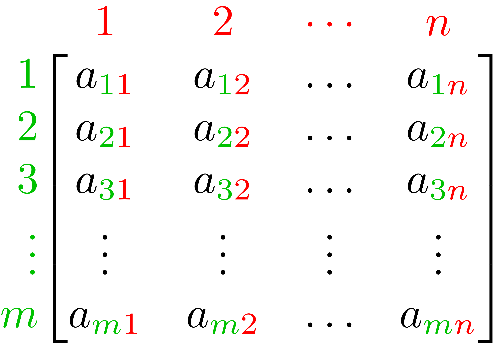

## Matrices

:::{.fragment}
What is a "matrix"?
:::

:::{.fragment}
> A rectangular array of numbers or other mathematical objects with elements or entries arranged in rows and columns.

:::

:::{.fragment}
Often, we use uppercase letters to represent an entire matrix and lowercase versions of the same letter to represent the individual elements within the matrix. For example...

:::

## Matrix contents

The elements in matrix $A$ might be referred to as $a_{ij}$, where $i \to$ row and $j \to$ column.

{.fragment .absolute top=250 left=200 height="400"}

## Matrix size

We describe the size of a matrix by its number of rows and columns. 
The matrix $A$ depicted below is an $m$-by-$n$ matrix ($m$ rows and $n$ columns).

{.absolute top=250 left=200 height="400"}


## Putting matrices in Python
We will use Numpy to work with matrices in Python.
They are 2-D versions of the arrays we've been working with already.

:::{.fragment}
To create a 2-D Numpy array, we pass a list of lists to the `np.array()` function. Each sublist contains the elements in a single **row** of the matrix. The length of each sublist (which must all be equal) is the number of **columns** in the matrix.

:::

:::{.fragment}

```{python}
#| echo: false
#| error: true
import numpy as np
```

```{python}
#| echo: true
#| output-location: fragment
#| error: true
A = np.array([[1, 2], [3, 4]])
print(A)
```
:::

## Getting info from matrices in Python
Access matrix elements with comma-separated indexing. The first index refers to the row and the second refers to the column.

::: {.panel-tabset}

### List and 1-D array indexing


```{python}
#| echo: true
#| output-location: default
#| code-line-numbers: false
#| error: true
x = np.array([0, 1, 2, 3, 4, 5, 6, 7, 8, 9, 10])
```

:::{.fragment}

```{python}
#| echo: true
#| output-location: column-fragment
#| code-line-numbers: false
#| error: true
print(x)
print(x[0])
print(x[3:])
print(x[:3])
print(x[3:6])
print(x[3:-3])
print(x[:])
```

:::

### Matrix indexing

```{python}
#| echo: true
#| output-location: fragment
#| error: true
A = np.array([[1, 2], [3, 4]])
A[:,0] # This should give all rows of the 0th column
```

:::{.fragment}
```{python}
#| echo: true
#| output-location: fragment
#| error: true
A[0,:] # This should give all columns of the 0th row
```

:::

:::{.fragment}
```{python}
#| echo: true
#| output-location: fragment
#| error: true
A[0,1] # This should the element from row 0 and column 1
```

:::

:::
## Matrix operations

We can perform several basic mathematical operations with matrices, but there are special rules depending on the kinds of objects involved in the opperation:

1. Scalar $\Leftrightarrow$ Matrix
1. Matrix $\Leftrightarrow$ Matrix (elementwise)
1. Matrix $\Leftrightarrow$ Matrix multiplication

## Scalar $\Leftrightarrow$ Matrix

For basic operations ($+$, $-$, $\times$, $\div$) between a scalar and a matrix, the operation is performed between the scalar and every element in the matrix.

:::{.fragment}
For example, if $B = w \times A$,

:::

:::{.fragment}
$$B = \begin{bmatrix}
w \times a_{11} & w \times a_{12} & \cdots & w \times a_{1n} \\
w \times a_{21} & w \times a_{22} & \cdots & w \times a_{2n} \\
\vdots & \vdots & \ddots & \vdots \\
w \times a_{m1} & w \times a_{m2} & \cdots & w \times a_{mn}
\end{bmatrix}$$
:::


## Scalar $\Leftrightarrow$ Matrix examples


:::{.panel-tabset}

### Example 1

$$3 + \begin{bmatrix}
2 & -1 & 4 \\
0 & 5 & -2
\end{bmatrix} = \begin{bmatrix}
5 & 2 & 7 \\
3 & 8 & 1
\end{bmatrix}$$


:::{.fragment}
```{python}
#| echo: true
#| output-location: column-fragment
#| error: true
A = np.array([[2, -1, 4], 
              [0, 5, -2]])
w = 3
print(w+A)
```
:::

### Example 2

$$0.1 \times \begin{bmatrix}
2 & -1 & 4 \\
0 & 5 & -2
\end{bmatrix} = \begin{bmatrix}
0.2 & -0.1 & 0.4 \\
0 & 0.5 & -0.2
\end{bmatrix}$$

:::{.fragment}
```{python}
#| echo: true
#| output-location: column-fragment
#| error: true
A = np.array([[2, -1, 4], 
              [0, 5, -2]])
v = 0.1
print(v*A)
```
:::

:::

## Matrix $\Leftrightarrow$ Matrix (elementwise)


Addition and subtraction between matrices is always performed *elementwise* (multiplication and division can be, but not always).

**Constraint:** matrix dimension must match exactly

:::{.fragment}
$$A_{m\times n} + B_{m\times n} = C_{m\times n}$$

:::

:::{.fragment}
$$C = \begin{bmatrix}
a_{11} + b_{11} & a_{12}+ b_{12} & \cdots & a_{1n}+ b_{1n} \\
a_{21} + b_{21}& a_{22}+ b_{22} & \cdots & a_{2n}+ b_{2n} \\
\vdots & \vdots & \ddots & \vdots \\
a_{m1} + b_{m1} & a_{m2}+ b_{m2} & \cdots & a_{mn}+ b_{mn}
\end{bmatrix}$$
:::

## Elementwise matrix examples

$$A = \begin{bmatrix}
2 & -1 & 4 \\
0 & 5 & -2
\end{bmatrix}; \quad B =  \begin{bmatrix}
1 & -1 & 2 \\
7 & 0 & 8
\end{bmatrix}$$

:::{.panel-tabset}

### Example 1


```{python}
#| echo: true
#| output-location: column-fragment
#| error: true
A = np.array([[2, -1, 4], 
              [0, 5, -2]])
B = np.array([[1, -1, 2], 
              [7, 0, 8]])
print(A+B)
```

### Example 2

```{python}
#| echo: true
#| output-location: column
#| error: true
A = np.array([[2, -1, 4], 
              [0, 5, -2]])
              
B = np.array([[1, -1, 2], 
              [7, 0, 8]])
print(A*B)
```

NOTE: this is **elementwise** multiplication, not **matrix multiplication**

### Example 3

```{python}
#| echo: true
#| output-location: default
#| error: true
B_2x2 = np.array([[1, -1], 
                  [7, 0]])
print(A+B_2x2)
```

:::


## Matrix multiplication
It is possible to perform *elementwise* multiplication and division, but generally **matrix multiplication** means something different.

:::{.fragment}
In order to multiply two matrices,$\ A \times B$, the number of **columns** in the first matrix ($A$) must equal the number of **rows** in the second matrix ($B)$.
:::

:::{.fragment}
The result of this operation, $C$, is a matrix with the same number of **rows** as the first matrix and the same number of **columns** as the second matrix.
:::

## Matrix multiplication dimensions

::: {.r-fit-text}
$$ A_{\color{blue}{n}\times \color{red}{m}}\ \times \ B_{\color{red}{m}\times \color{green}{p}} = C_{\color{blue}{n} \times \color{green}{p}}$$
:::

## Non-commutative

Because of the rules of matrix multiplication, the operation is **non-commutative**:

$$A \times B \neq B \times A$$

:::{.fragment}
In fact, if $A \times B$ is a valid operation, it's not guaranteed that $B \times A$ is valid.
:::

:::{.fragment}
For example, if $A$ is a 4-by-2 matrix and $B$ is a 2-by-3 matrix,

:::

::::{.columns}
:::{.column}
:::{.fragment}
**Valid**: $A \times B$
:::
:::

:::{.column}
:::{.fragment}
**Invalid**: $B \times A$
:::
:::
::::

## Matrix multiplication definition

The element $c_{ij}$ in the product matrix $C = A \times B$ is calculated as:

$$c_{ij} = \sum_{k=1}^{m} a_{ik} b_{kj}$$


:::{.fragment}
For example:
$$c_{11} = a_{11}b_{11} + a_{12}b_{21} + a_{13}b_{31} + \cdots + a_{1m}b_{m1}$$
:::

## Matrix multiplication example

$$\begin{bmatrix}
a_{11}  & a_{12}\\
a_{21} & a_{22} \\
a_{31} & a_{32} \\
a_{41} & a_{42} \\
\end{bmatrix}
\times
\begin{bmatrix}
b_{11}  & b_{12} &  b_{13} \\
b_{21} & b_{22} &  b_{23} \\
\end{bmatrix}
=
\begin{bmatrix}
c_{11}  & c_{12} &  c_{13} \\
c_{21} & c_{22} &  c_{23} \\
c_{31} & c_{32} &  c_{33} \\
c_{41} & c_{42} &  c_{43} \\
\end{bmatrix}$$

:::{.fragment}
$$
c_{11} = a_{11}b_{11} + a_{12}b_{21} \\
\vdots \\
c_{43} = a_{41}b_{13} + a_{42}b_{23}
$$
:::

## Matrix multiplication in Python

In Python, we use a special operator on Numpy arrays for matrix multiplication: `@`

::: {.panel-tabset}

### Example 1
```{python}
#| echo: true
#| output-location: column-fragment
#| error: true
A = np.array([[1, 2], 
              [3, 4],
              [5, 6],
              [7, 8]])
B = np.array([[2, 1, 0], 
              [3, 2, 1]])
print(f"A has shape {A.shape}")
print(f"B has shape {B.shape}")
C = A @ B
print(f"C has shape {C.shape}")
print(C)
```

###  2
```{python}
#| echo: true
#| output-location: column-fragment
#| error: true
A = np.array([[1, 2], 
              [3, 4],
              [5, 6]])
              
B = np.array([[2, 1, 0], 
              [3, 2, 1]])
print(f"A has shape {A.shape}")
print(f"B has shape {B.shape}")
C = A @ B
print(f"C has shape {C.shape}")
print(C)
```


###  3
```{python}
#| echo: true
#| output-location: column-fragment
#| error: true
A = np.array([[1, 2], 
              [3, 4],
              [5, 6]])
B = np.array([[2, 1, 0], 
              [3, 2, 1]])
print(f"A has shape {A.shape}")
print(f"B has shape {B.shape}")
C = B @ A # <-- reversing order
print(f"C has shape {C.shape}")
print(C)
```


###  4
```{python}
#| echo: true
#| output-location: column-fragment
#| error: true
A = np.array([[1, 2, 8], 
              [3, 4, 4],
              [5, 6, 3]])
B = np.array([[2, 1, 0], 
              [3, 2, 1]])
print(f"A has shape {A.shape}")
print(f"B has shape {B.shape}")
C = A @ B
print(f"C has shape {C.shape}")
print(C)
```

###  5
```{python}
#| echo: true
#| output-location: column-fragment
#| error: true
A = np.array([[1, 2, 8], 
              [3, 4, 4],
              [5, 6, 3]])
B = np.array([[2, 1, 0], 
              [3, 2, 1],
              [0, 9, 7]])
print(f"A has shape {A.shape}")
print(f"B has shape {B.shape}")
C = A @ B
print(f"C has shape {C.shape}")
print(C)
```

###  6
```{python}
#| echo: true
#| output-location: column-fragment
#| error: true
A = np.array([[1, 2, 8], 
              [3, 4, 4],
              [5, 6, 3]])
B = np.array([[2, 1, 0], 
              [3, 2, 1],
              [0, 9, 7]])
print(f"A has shape {A.shape}")
print(f"B has shape {B.shape}")
C = B @ A # <-- reversing order
print(f"C has shape {C.shape}")
print(C)
```

:::

## Matrix "division"

There isn't a division matrix operation that corresponds to matrix multiplication like traditional multiplication and division. 
However, for certain **square** matrices, multiplying by the **inverse** of the matrix produces a similar effect to division:


::::{.columns}
:::{.column}
:::{.fragment}
$$A \times A^{-1} = I$$

:::
:::

:::{.column}
:::{.fragment}
- $A$ is an invertable square matrix
- $A^{-1}$ is the inverse of $A$
- $I$ is the **identity matrix**
:::
:::
::::

## Identity matrix

The identity matrix, $I$, is a square matrix with ones on the main diagonal and zeros elsewhere.

::::{.columns}
:::{.column}
:::{.fragment}
$$I_3 = \begin{bmatrix}
1 & 0 & 0 \\
0 & 1 & 0 \\
0 & 0 & 1
\end{bmatrix}$$
:::
:::

:::{.column}
:::{.fragment}
**Key property:** Multiplying any matrix by the identity matrix leaves it unchanged:

$$A \times I = I \times A = A$$
:::
:::

::::

:::{.fragment}
The identity matrix plays the same role in matrix multiplication that the number $1$ plays in regular multiplication.
:::

## Matrix inversion in Python

We will use the `scipy.linalg` Python module to perform matrix inversion.

::::{.columns}
:::{.column}
:::{.fragment}
```{.python}
from scipy import linalg
A = np.array([[1, 2], 
              [3, 4],
              [5, 6],
              [7, 8]])
print(linalg.inv(A))
```
:::
:::

:::{.column}
:::{.fragment}
`ValueError: expected square matrix`
:::
:::
::::

:::{.fragment}
```{python}
#| echo: true
#| output-location: fragment
#| error: true
from scipy import linalg
A = np.array([
    [1, 3, 4], 
    [4, -1, 8],
    [-1, -4, 1]])
print(linalg.inv(A))
```
:::

## Off-diagonal "zeros"

:::{.fragment}
```{python}
#| echo: true
#| output-location: fragment
#| error: true
from scipy import linalg
A = np.array([
    [1, 3, 4], 
    [4, -1, 8],
    [-1, -4, 1]])
    
A_inv = linalg.inv(A)
print(A @ A_inv)
```
:::

:::{.fragment}
```{python}
#| echo: true
#| output-location: column-fragment
#| error: true
I = np.identity(3)
print(I)
```
:::

## Matrix applications

There are several useful applications for matrices in engineering. 

:::{.fragment}
In this class, we will focus on **solving systems of equations**
:::