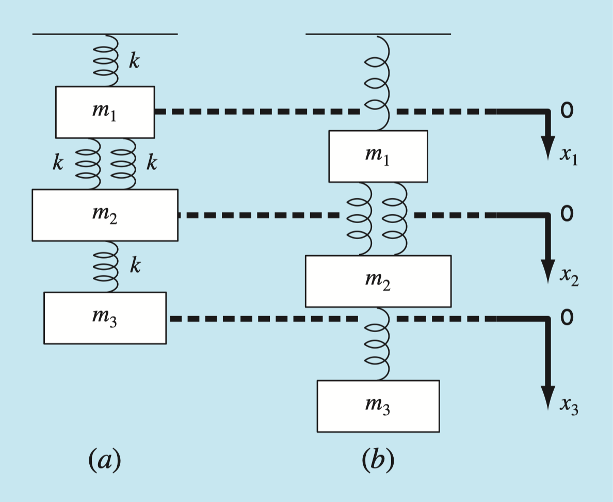
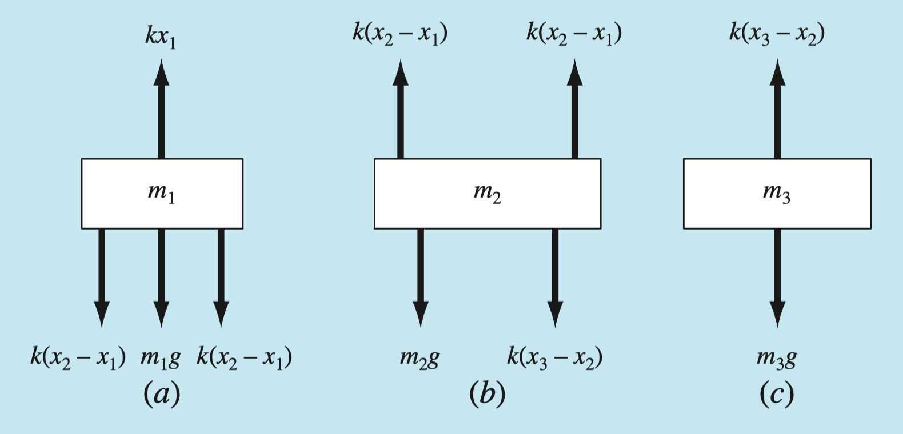

## Systems of equations

$$
x + 3y + 4z = 8\\
4x - 2y + 8z = -4\\
-x + 4y + z = 12
$$

:::{.fragment}
Solve for $x$, $y$, and $z$
:::

:::{.fragment}
We can solve any system of equations as long as...

- The number of equations is $\geq$ the number of unknowns
- The equations are linearly independent
:::

## Solving systems of equations

In algebra, we learned different methods to solve for unknowns.

- Graphing
- Substitution
- Elimination
- *Guess and check*?

:::{.fragment}
We'll use matrices and concepts from linear algebra to get Python to solve systems of equations for us.
:::

## Matrix form

First, we need to put our system of equations into matrix form:

::::{.columns}
:::{.column}
$$A\bf{x} = \bf{b}$$

:::

:::{.column}
- Coefficients matrix, $A$
- Unknowns vector, $\bf{x}$
- Constants vector, $\bf{b}$
:::
::::

:::{.fragment}

$$
\begin{bmatrix}
a_{11}  & a_{12} & a_{13}\\
a_{21} & a_{22} & a_{23} \\
a_{31} & a_{32} & a_{33} \\
\end{bmatrix}
\times
\begin{bmatrix}
x_{11}\\
x_{21}\\
x_{31}\\
\end{bmatrix}
=
\begin{bmatrix}
b_{11}\\
b_{21}\\
b_{31}\\
\end{bmatrix}
$$

:::


## System of equations example

$$
x + 3y + 4z = 8\\
4x - 2y + 8z = -4\\
-x + 4y + z = 12
$$

::::{.columns}

:::{.column width="33%"}

:::{.fragment}

$$
A=
\begin{bmatrix}
1  & 3 & 4\\
4 & -2 & 8 \\
-1 & 4 & 1 \\
\end{bmatrix}
$$

:::

:::

:::{.column width="33%"}

:::{.fragment}
$$
{\bf{x}} \to
\begin{bmatrix}
x\\
y\\
z\\
\end{bmatrix}
$$

:::

:::

:::{.column width="33%"}
:::{.fragment}

$$
{\bf{b}} \to
\begin{bmatrix}
8\\
-4\\
12\\
\end{bmatrix}
$$

:::
:::
::::


## System of equations example

$$
x + 3y + 4z = 8\\
4x - 2y + 8z = -4\\
-x + 4y + z = 12
$$


$$
\begin{bmatrix}
1  & 3 & 4\\
4 & -2 & 8 \\
-1 & 4 & 1 \\
\end{bmatrix}
\times
\begin{bmatrix}
x\\
y\\
z\\
\end{bmatrix}
=
\begin{bmatrix}
8\\
-4\\
12\\
\end{bmatrix}
$$

## Solving

To solve for $\bf{x}$, we "divide" both sides by $A$ (i.e., multiply both sides by $A^{-1}$):


:::{.fragment}
$$A{\bf{x}} = \bf{b}$$
:::

:::{.fragment}
$$A^{-1}A{\bf{x}} = A^{-1}\bf{b}$$
:::

:::{.fragment}
$$I{\bf{x}} = A^{-1}\bf{b}$$
:::

:::{.fragment}
$${\bf{x}} = A^{-1}\bf{b}$$
:::

## Solved in Python

```{python}
#| echo: true
#| output-location: column-fragment
#| error: true
import numpy as np
from scipy import linalg
A = np.array([
    [1, 3, 4], 
    [4, -2, 8],
    [-1, -4, 1]])
b = np.array([
    [8], 
    [-4],
    [2]])
# A@x = b --> x = A_inv@b
x = linalg.inv(A) @ b 
# Or use the "solve" function:
# x = linalg.solve(A, b) 
print(x)
```

:::{.fragment}

```{python}
#| echo: true
#| output-location: column-fragment
#| error: true
print(A@x)
```

:::


## Linear independence?
What about the requirement that the equations in our system are "linearly independent"?

- The coefficients matrix ($A$) will have a non-zero determinant if the system is linearly independent.

:::{.fragment}

```{python}
#| echo: true
#| output-location: column-fragment
#| error: true
linalg.det(A)
```

:::

:::{.fragment}

```{python}
#| echo: true
#| output-location: column-fragment
#| error: true
A = np.array([
    [1, 3, 4], 
    [4, -2, 8],
    [8, -4, 16]])
linalg.det(A)
# A is "singular"
```

:::

## Engineering example

::::{.columns}
:::{.column width="60%"}
{fig-align="center"}

:::

:::{.column width="40%" }
Given:

- $k = 10$ N/m 
- $m_1 = 2$ kg, $m_2=3$ kg, $m_3 = 2.5$ kg

Find:

- $x_1$, $x_2$, and $x_3$

:::{.fragment}
Assume the system is at-rest.
:::
:::
::::

## Engineering example

For each mass, $\sum F = F_{up} - F_{down} = 0$

{fig-align="center"}

## Engineering example

Summing forces on each mass:

:::{.fragment}
$$
\sum F = kx_1 - 2k(x_2 - x_1) - m_1 g = 0
$$
:::

:::{.fragment}
$$
\sum F = 2k(x_2 - x_1) - k(x_3 - x_2) - m_2 g = 0
$$
:::

:::{.fragment}
$$
\sum F = k(x_3 - x_2) - m_3 g = 0
$$
:::

## Engineering example

Let's group items by the unknowns, $x_1$, $x_2$, and $x_3$, and move the gravitational forces to the other side:

:::{.fragment}
$$
\begin{matrix}
3kx_1 & - 2kx_2  & \ & = &  m_1 g \\
-2kx_1 & + 2kx_2  &-kx_3& = & m_2 g \\
\ & - kx_2 &+ kx_3 &=& m_3g
\end{matrix}
$$
:::

## Engineering example

And then put the system of equations into the form $A{\bf{x}} = \bf{b}$:

$$
\begin{matrix}
3kx_1 & - 2kx_2  & \ & = &  m_1 g \\
-2kx_1 & + 2kx_2  &-kx_3& = & m_2 g \\
\ & - kx_2 &+ kx_3 &=& m_3g
\end{matrix}
$$

::::{.columns}

:::{.column width="40%"}

:::{.fragment}

$$
A=
\begin{bmatrix}
3k  & -2k & 0\\
-2k & 2k & -k \\
0 & -k & k \\
\end{bmatrix}
$$

:::

:::

:::{.column width="30%"}

:::{.fragment}
$$
{\bf{x}} \to
\begin{bmatrix}
x_1\\
x_2\\
x_3\\
\end{bmatrix}
$$

:::

:::

:::{.column width="20%"}
:::{.fragment}

$$
{\bf{b}} \to
\begin{bmatrix}
m_1g\\
m_2g\\
m_3g\\
\end{bmatrix}
$$

:::
:::
::::


## Mass-spring example in Python

```{python}
#| echo: true
#| output-location: column-fragment
#| error: true
k = 10 # N/m
m1, m2, m3 = 2, 3, 2.5 # kg
g = 9.81 # m/s/s

A = k * np.array([
    [3, -2, 0],
    [-2, 3, -1],
    [0, -1, 1]])
b = [m1*g, m2*g, m3*g]
x = linalg.solve(A, b)
print(x)
```

## Making it "singlular"{.smaller}
```{python}
#| echo: true
#| output-location: column-fragment
#| error: true
k = 10 # N/m
m1, m2, m3 = 2, 3, 2.5 # kg
g = 9.81 # m/s/s

# alter A to remove any influence
# from the spring connecting m1 to
# the anchor point... no longer 
# a statics problem!
A = k * np.array([
    [0, -2, 0],
    [0, 3, -1],
    [0, -1, 1]])
b = [m1*g, m2*g, m3*g]
x = linalg.solve(A, b)
print(x)
```